# Overview

Repository to track leaning and hands-on for OOPs principles and Design patterns

# Notes

## Object Oriented Programming Principles

1. **Encapsulation**  
    It is concerned with bundling data and methods that operate on the data in a single unit.    
    It also hides the internal state of a class so that we can create robust applications.  
    ```java  
    public class Account {
        private int balance;
        public void deposit(int amount) {
            if(amount>0)
                balance+=amount;
        }
        public void withdraw(int amount) {
            if (amount > 0 && balance >= amount)
                balance -= amount;
        }
        public int getBalance() {
            return balance;
        }
    }
   ```
    *Without Encapsulation, we would have declared `balance` as public, 
    thus we would not have control over what values the balance can have(negative or positive)*
2. **Abstraction**  
    It states that we should reduce complexity by hiding unnecessary details from the user.  
    We make everything else private or abstracted from user and only expose necessary interface or functions.
   ```java
    public class MailService {
       public void sendEmail() {
           connect();
           authenticate();
           disconnect();
       }
       private void connect() {
           System.out.println("Connected");
       }
       private void disconnect() {
           System.out.println("Disconnected");
       }
       private void authenticate() {
           System.out.println("Authenticated");
       }
    } 
   ```
   *We only expose `sendMail` method to the user and hide internally used functions like `connect`, `disconnect` etc.  
    This helps to simplify usage for the end user as any unnecessary methods are hidden from user*  
3. **Inheritance**  
    It is principle which states that we should implement common code in a parent class and inherit those in our child class.  
    This will reduce code duplication as well as development effort of re-writing same logic in every child class.
    ```java
    public class UIControl {
        public void enable() {
            System.out.println("Enabled");
        }
    }
    
    public class TextBox extends UIControl{
        public void acceptInput() {
            System.out.println("Accepting input");
        }
    }
    
    public class Paragraph extends UIControl{
        public void displayText() {
            System.out.println("Text displayed");
        }
    }
   
    public class InheritanceMain {
        public static void main(String[] args) {
            TextBox textBox = new TextBox();
            textBox.enable();
            textBox.acceptInput();
            Paragraph paragraph = new Paragraph();
            paragraph.enable();
            paragraph.displayText();
        }
    }
    ```
   *We would have implemented `enable` method in both `TextBox` as well as `Paragraph`, 
    but due to inheritance, we were able to skip redefining*
4. **Polymorphism**  
    It means that the same function can take many form.  
    It can be runtime polymorphism or compile time polymorphism.  
    ***Runtime Polymorphism***: It can be achieved by overriding a function in child classes.  
    - When a function accepts a parent class object, and we pass a child class object which overrides a function, 
         then the child class function is called instead of the parent class  
    - When we use parent class or interface reference to call a function, 
       the implementation of the function will depend on the type of instance assigned to the reference.   
    
    ***Compile Time Polymorphism***: It can be achieved by method overloading.  
    - When we have multiple functions with same function name but different number or type of parameters, 
         During function call, JVM will decide which function to call based on the number or type of parameters passed.  

## SOLID Design Principles

1. **Single Responsibility Principle**  
    It states that there should never be mote than one reason for a class to change.  
    It means, a class provides very focused functionality and address a specific concern.  
    - Say we have a class which is responsible to communicate with a server. It will change due to change in following.  
      - Protocol change
      - Message format change
      - Authentication change  

    *In the example code, we can see that `ControllerBad` may change if validation logic changes, or storage logic changes.
    The `ControllerGood` does not hold validation or storage logic inside it thus it is less likely to be affected*
2. **Open-Close Principle**  
    Software entities (classes, modules, methods etc.) should be open for extension, but closed for modification.  
    Open for extension means that a child class can inherit base class and can override existing behavior.  
    Closed for modification means that the base class should not be modified once it has been written.  
    It states that one should have a solid base class that contains all functionality and fields that will not change.  
    - *In the code example, `Subscriber` is the base class that is closed for modification, 
         and it contains only parts which will not be changed.*  
    - *The `calculateBill()` method is what is open for extension, any child class extending `Subscriber` 
       will modify this method, this keeps the base class unchanged while it is still open for extension.*
3. **Liskov Substitution Principle**  
    It states that we should be able to substitute a base class object with an object of a child class.  
    It not only means simple type substitution, but it also expects same behavior from child class object as expected from parent class object.  
    Say a `JsonStringifySorted` class has a method `stringify` which returns a JSON string in alphabetically sorted order, 
    then the child class should also on using `stringify` method should return the result in alphabetically sorted order.  
    <em>In the code example `Square` is violating Liskov Substitution Principle in the following ways
    - When we set width of any rectangle, we should get back the same value unless we reset the width  
    - When we set height of any rectangle, we should get back the same value unless we reset the height
    - When we get the area of any rectangle, it should be `width*height` which was set and not `side*side`

    This issue occurred as we did not create the correct Parent Child relationship by choosing wrong classes for the relationship</em>
4. **Interface Segregation Principle**  
    This states that the client should not be forced to implement an interface that it does not use.  
    This means that any interface or abstract class should have only those methods that are relevant to it.  
    If any method is not relevant to the interface, then it should be moved to a separate interface.  
    To identify violation of this principle, we can check the following:  
    - If a class has empty method implementations
    - If a class has all the methods implemented, but some of them throw `UnsupportedOperationException` or something similar
    - Method implementation return null or default/dummy values.
     
    *In the code examples, in good implementation of `EntityPersistenceService`, 
    we only include those functionalities to be implemented which are relevant to any class 
    that will implement the `EntityPersistenceService` interface. While in bad implementation of `EntityPersistenceService` 
    we included `List<T> getByName(String name)` which is bot relevant to `OrderPersistenceService`, thus breaking functionality*
5. **Dependency Inversion**  
    It states that a high level module(business logic implementation) should not depend on low level module 
    such as FileWriter, JsonFormatter etc.  
    These dependencies should be abstracted out and injected into the high level module by the client application.  
    The client application is the one which is using this high level module.  
    *In the code example, the good `Logger` class implementation accepts low level module of `Writer` and `Formatter` 
    This gives the flexibility to the client to select desired `Formatter` and `Writer`.  
    The bad `Logger` class implementation tightly couples itself to `JsonFormatter` and `PrintWriter` reducing flexibility*

## Design Patterns

Types of design patterns:
- ***Creational***: These deal with the process of creation of objects of classes.  
- ***Structural***: These deal with how classes and objects are arranged oir composed.  
- ***Behavioral***: These deal with how classes and objects interact and communicate with each other.  

### Structural Design Pattern

1. **Adapter Pattern**  
   If existing object which provides functionality that client needs but the client expects an object with different interface.  
   - ***Steps to implement***
      - Create class for Adapter which implements interface expected by client
      - We can then extend Adaptee class and redirect method call of target interface to functions inherited from Adaptee
        This is called a class adapter and is a two-way adapter as Adapter class can be used both as Target or Adaptee 
      - We can alternatively accept Adaptee class object as a constructor argument and redirect method calls to Adaptee object  
   - ***Things to consider***
      - Sometimes Adaptee and Target interface may differ based on the method signature, 
        thus we might need some transformation in Adapter class to make it compatible
      - We should avoid overriding existing Adaptee methods as it will cause Adapter and Adaptee to behave differently
      - Try using object Adapter as the Adaptee implementation can be changed if required, 
        and also if both Adaptee and Target are classes 
      - Another reason to avoid class Adapter is that we will expose both Adaptee and Target interface methods, 
        which will cause extra functions to be exposed than required which is not a good practice.
      - Always do simple interface translation, do not add business logic, validation to Adapter.
   - ***Examples***
     - java.io.InputStreamReader and java.io.OutputStreamWriter
       These adapt existing `InputStream`/`OutputStream` object to a `Reader`/`Writer` interface
   - ***UML***
       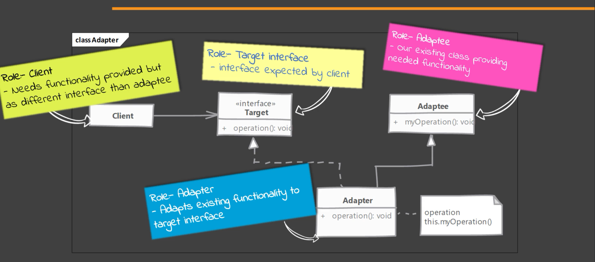
       
2. **Bridge Pattern**  
   During inheritance using interface or abstract class or simple class, our class is coupled to the abstraction.  
   If we want to change the interface of already implemented class, we need to make changes to its interface and implementation.  
   Using bridge pattern, we can make these 2 independent so that we can change the interface without changing existing interface.   
   It creates 2 hierarchy, one for the abstraction that will be used by client, the other is implementation abstraction.  
   The abstraction hierarchy will have an implementation of implementor which will be a concrete implementor  
   Using the instance of the implementor, the concrete abstraction class will accomplish the operations of abstraction.  
   eg: `LIFOCollection` is an abstraction which has `push` and `pop` methods
   `Stack` is an example of concrete implementation of `LIFOCollection` but it will use an implementation of `List` interface
   `LinkedList` is a concrete implementation of `List` interface which has `addLast`, `removeLast`, etc. methods
   `Stack` can have an instance of `LinkedList` and use `addLast` and `removeLast` methods of the instance to define `push` and `pop`
    - **Steps to implement**  
      - Create abstraction/ interface which client will use along with the required methods which client will use
        This abstraction can itself be a concrete class.
      - Define implementor interface. Implementor methods do not have to match with abstraction, 
         but these methods should be such that abstraction implementation can implement methods using instance of implementor. 
      - Write one or more concrete implementor. The implementor implementation can itself be a concrete class
      - When creating object of abstraction interface, we pass the concrete class of implementor to get a composition
    - **Things to consider**  
      - We can skip creating implementor interface if we will only have single implementation of implementor  
      - Our abstraction implementation can either use a concrete implementor or delegate the decision to client code  
    - **Example**  
      - java.sql.DriverManager and java.sql.Driver
        DriverManager has `getConnection` method which uses a Driver internally. The Driver has `connect` method
        The implementation of Driver can be different for different databases like `com.mysql.jdbc.Driver` and 
         `oracle.jdbc.driver.OracleDriver` 
    - **UML**  
        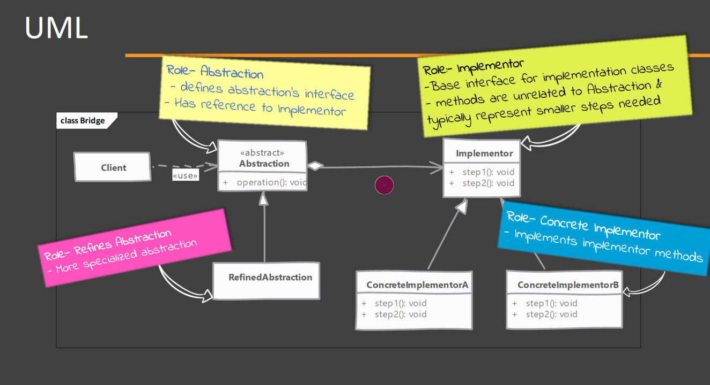
    - **Difference from Adapter Pattern**  
      - Adapter is used when we already have all the implementations but the interface do not match
      - Bridge is used when we have implementations which can be used to provide required functionalities 
      by single or by combining multiple existing implemented method(s) from the concrete implementor
3. **Decorator Pattern**  
   When we want to extend the functionality or enhance the behavior of existing object dynamically as and when required, 
   we use decorator pattern. Decorator wraps the object within itself and provides same interface as the wrapped object.  
   This helps in keeping the client of original object unchanged. It provides alternate to subclassing for extending functionality.
    - **Steps to implement**  
      - Identify component interface which needs to be defined or is being already used by clients.  
      - A concrete component will implement the component interface.  
      - A decorator is defined which implement Component interface while also has a Component as a reference.  
      - Add additional behaviour on top of the passed reference behaviour.  
      *Note: Decorator can be abstract as well and depend on subclasses to provide functionality*  
    - **Things to consider**  
      - Avoid using large state in base class as decorators may not need all the state.  
      - Decide whether `equals` and `hashCode` methods should be overridden i.e. if decorated instance should equal base instance.
      - Since it is a recursive composition, debugging, can be tough at times when there is very large hierarchy.  
      - Decorator is more powerful than inheritance as it allows dynamic or runtime changes while inheritance is static.  
      - The decorator should add small addition to the object it decorates and should not change the functionality all together.  
    - **Example**
      - Classes in Java's I/O package
      - java.io.BufferedOutputStream and java.io.OutputStream
        BufferedOutputStream is decorator which adds buffering to any output stream
    - **UML**
      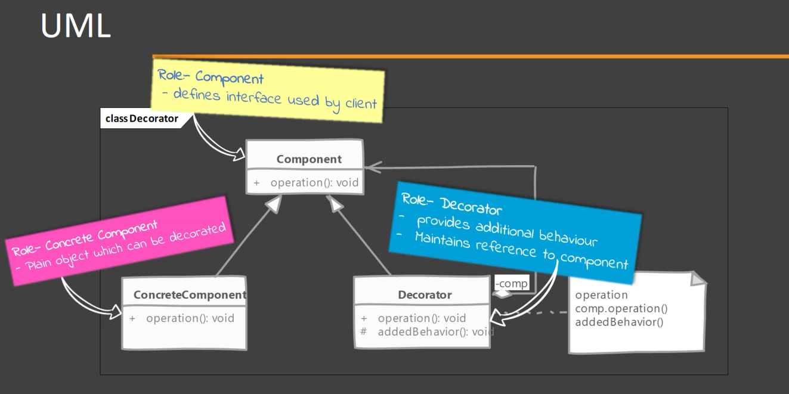
    - **Difference from Adapter Pattern**
      - Adapter changes interface without changing behaviour. 
        An adapter cannot be used in place of an Adaptee thus it is also difficult to recursively compose Adapter and Adaptee.
      - Decorator changes behaviour without changing interface
        A decorator can be used in place of a Component since they share same interface and can be composed recursively.  
4. **Composite Pattern**  
   If we have a hierarchy of objects, and we want to give them a common interface, then we can use composite design pattern.  
   It helps in treating objects that use composition in same way as one that does not use.  
   eg: `FileSystemComponent` can be the common interface, while `TextFile` and `Directory` are its concrete implementation.  
   We can decide if we only want to keep common functionality defined in `FileSystemComponent`, 
   or we want to add children management functionalities also.  
   These children management functionalities, though implemented in leaf node, will only throw unsupported exception.  
   These are arguably added as purpose of Composite pattern is to treat leaf as well as ancestor nodes in the same way.  
    - **Steps to implement**
        - Create a Component interface which has all the common functionalities declared
        - Decide if the children management functionalities are to be included in Component interface
        - Add Composite as an implementation of Component which propagates the invoked operation to all its children
        - Implement Leaf as another implementation of Component which implements the common functionalities,
          if the children management functionalities are also to be implemented, handle these functionalities with exceptions
    - **Things to consider**
        - We can provide method to access parent node. This simplifies tree traversal in any order
        - If we are using a node in many different places in the tree, 
          we can cache them if they are immutable and initialization cost is high
        - Design principle of the pattern suggest having child management functionalities in Composite interface.
          This helps the client to not care about if they are working with leaf or any other implementation 
    - **Example**
        - In JSF, we have `UIViewRoot` which is interface, `UIComponentBase` is a base implementation, 
          `UIMessage` and `UIOutput` are leaf components while `UIViewRoot` is non-leaf component. All extend `UIComponentBase`
    - **UML**
      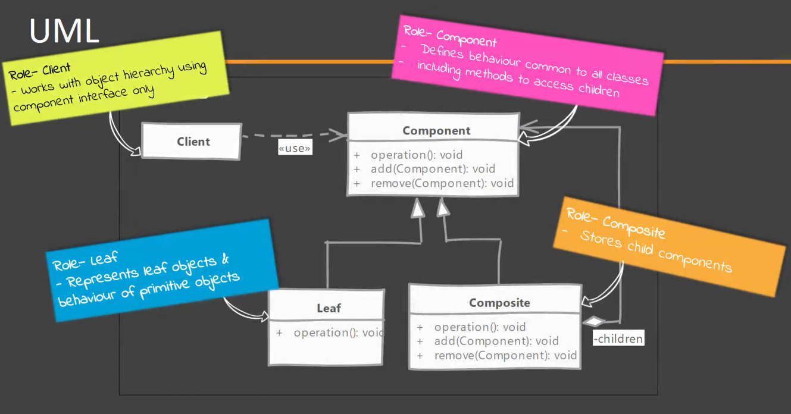
    - **Difference from Decorator Pattern**
        - In Decorator, intent is to `add to` existing behaviour, and can be considered as composite with single child.
            Contains a single object and not children, and add or modify the behaviour of contained object
        - In Composite, it is for aggregation, and can have any number of children. It deals with tree structures. 
            Composites only delegate operation to children without any modification
5. **Facade Pattern**  
If our client code interacts with a large number of classes that are part of a subsystem, e.g. email related classes to send email.
This tightly couples our code to many classes or interface.  
Facade pattern solves this issue by exposing a simple and unified interface to the subsystem. 
Client interacts with just the facade to get the same result
    - **Steps to implement**
        - Create a Facade class which will have functions which will be exposed to client
        - These functions should be relevant to what the subsystem should do, e.g. `sendOrderEmail`, `writeFileToDisk`.
        - Use different available classes to implement these functionalities
    - **Things to consider**
        - Should minimize complexity of using subsystem by exposing usable and simple interface
        - We can create Facade as interface and have concrete implementation classes for it 
          if our subsystem can have multiple implementation
        - Facade is used to reduce coupling between subsystems as without facade, 
          the client is too much aware of how things are working
        - If simplification of subsystem if not a primary concern and only loose coupling is required, 
          we can use Factory pattern
        - If we are often in need of using Facade pattern, 
          we need to review our code as to why our original system being developed is so complex to use.
        - Facade is often used to hide improper API design and is used as container of related methods which is wrong.
    - **Example**
        - `java.net.URL` which is used to locate a resource on web or on local file system, 
           we can get input stream by simply using `openStream()`. 
          It eliminates interaction and tight coupling with `java.net` and `sun` packages.
    - **UML**
      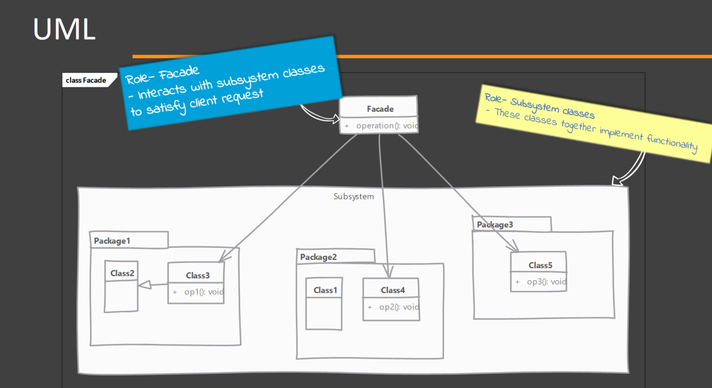
    - **Difference from Adapter Pattern**
        - Adapter is for adapting object to different interface, it needs to adhere to a particular interface needed by client
        - Facade intent is to simplify usage of subsystem for client, it can implement and need not adhere to any interface
          The end goal is to make using the subsystem for the client easier and simpler
6. **Flyweight Pattern**    
   If we can have a large number of instances of a particular class, and each instance can take up a good amount of space,
   this can lead to performance concerns. 
   Instead of sharing the entire object, we can divide these instances having some intrinsic and some extrinsic states. 
   eg:  
   1. We can have multiple instances of error messages which have the same template string, 
     just the error code is changed in template for each instance, then we can consider template as intrinsic state, 
     while error code is considered extrinsic state.
   2. We can have multiple instances of an image in game, say an image appears at multiple location within the game, 
     we can create the image matrix as intrinsic state, while the location of each instance can be extrinsic state.
     We can create a single instance of the object and whenever we want to render the image, 
     we pass the extrinsic state i.e. location to the render function

   We use factory to return the object of the Flyweight class, 
   so that Client does not need to know how object is created, shared or cached  
    *We can also have instances where we cannot share the states, thus some concrete classes of Flyweight are typical classes*
   - **Steps to implement**
        - Identify intrinsic and extrinsic state of our object
        - Create an interface for Flyweight to provide common methods that accept extrinsic state e.g. `render(Location)`
        - In shared flyweight implementation, we implement the common methods by assuming extrinsic state to be passed
        - In unshared flyweight implementation, we ignore that the extrinsic state will be passed, 
          and we store all state within the object and the common method uses this object state from within.
        - Flyweight factory will cache shared implementation instances and also provide methods to retrieve them
        - The extrinsic state can be stored in client side or computed on the go when using shared Flyweight implementation
   - **Things to consider**
        - Factory is needed as we need a central place to hold shared instances.  
          Number of shared instances can be large, hence this helps in keeping track in a central location
        - The intrinsic state should be immutable
        - Our usage is dependent on whether we can identify an extrinsic state that client can pass
   - **Example**
        - Wrapper classes like java.lang.Integer, Short, Byte etc. but not Float, Double etc.
          It is used as Flyweight when we use `valueOf` static method of these classes. 
          When we call the static function, we get the same instance everytime for each wrapper type
          The factory cache of `Integer` and other wrappers hold some pre-defined instances 
          like for `Integer` it might have instances cached for values from -128 to 127, 
          so whenever we call `Integer.valueOf`, it does not create a new `Integer` instance, rather it returns cached instance.
        - String pool. When we define strings using double quotes, these are stored/cached in String pool.
          If we call `intern` function of String object, it will check if String pool has that String and return the reference, 
          if not present, then it will create an instance in pool and return thr reference.
   - **UML**
      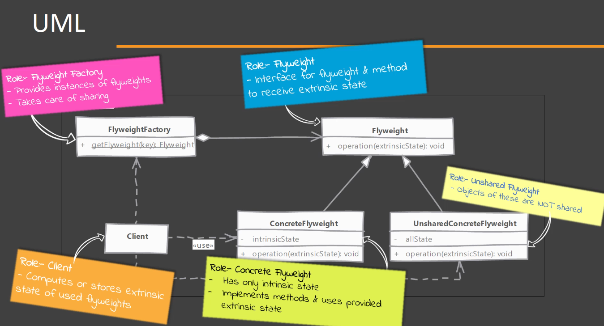
   - **Difference from Object Pool**
        - State of flyweight is divided and the client must provide the extrinsic state.  
            The client will not change intrinsic state of flyweight instance 
        - Pooled object contains all its state encapsulate within itself.  
            Clients can and do change the state of pooled objects.  
7. **Proxy Pattern**    
      Whenever we want an object that can be substituted or can take place of actual object, we can use proxy.
      This pattern or Proxy are used for a wide range of use cases
      1. Protection Proxy: Control which operations can be called on real object
      2. Remote Proxy: It provides a local representation of remote object and the proxy handles network calls to remote object
      3. Virtual Proxy: It delays construction of real object until necessary  
      *Client does not know that a proxy exists*  
      eg:  
      Lazy loading of collection by Hibernate  
      AOP based security provided by SpringFramework  
   - **Steps to implement**
       - Proxy must implement the same interface as implemented by real object
       - We can create actual object later when required or ask for one in constructor
       - In method implementation of proxy, we implement proxy's functionality and delegate call to real object when required
       - We can decide based on our use case if we want a factory to provide proxy instance or directly create on in client code
       - Proxy is also supported by Java using `InvocationHandler`
   - **Things to consider**
       - Whether a Proxy accepts a proxy or creates one on demand is based on type of proxy.  
         For Virtual proxy, we just want to delay creation of real object, 
         hence we create one inside the proxy object when needed  
         For Protection proxy, we just want to apply some check before we delegate the call, 
         hence we required real object at the very beginning  
       - Take into consideration synchronization as this is not inherited by default from real object
       - Proxy themselves can maintain state/cache on behalf of real object, until the real object is created
       - A proxy when implemented, need not know about real object, it can assume it is implemented even if it actually is not
       - Try to use proxy pattern if possible as it is a good way of wrapping and handling security
       - Java provides dynamic proxy for classes which implement at least one interface
       - Since some proxy create object inside themselves, chaining proxies can cause instantiation of multiple instances.  
         Thus, it is important that we club all functionalities that are to be incorporated in a single proxy class 
         rather than multiple proxies and chaining them somehow.
   - **Example**
       - Whenever a collection or relation in Hibernate is marked as Lazy loaded, Hibernate uses virtual proxy pattern
       - Spring uses proxy for features like transactions, caching and general AOP support
   - **UML**
     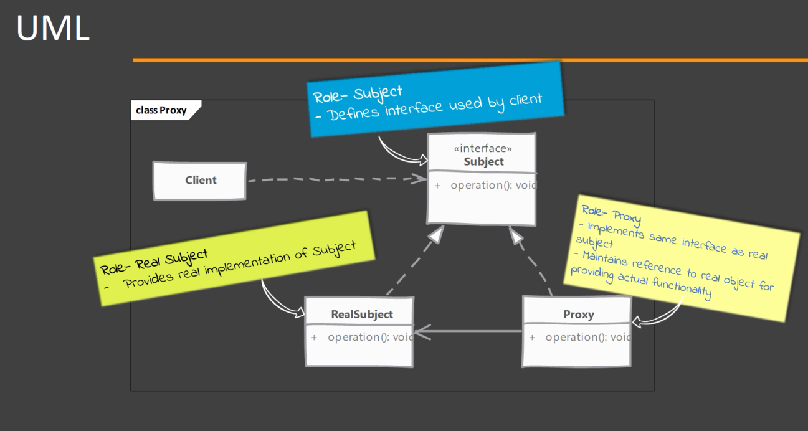
   - **Difference from Decorator**
       - Decorator always needs a real object which it can wrap 
         and provides functionalities that are visible and usable by client
       - Proxy does not always need a real object 
         and provides features like access control, lazy loading, auditing, etc. which is not necessarily used by client

### Behavioral Design Pattern

1. **Chain Of Responsibility Pattern**  
    When we need to avoid coupling code which send request to the code which handles the request.  
    Chain of responsibility solves problem of knowing exact object and method to call for request, 
    it gives more than one object, the chance to process the request. Just need to know first object in chain.  
    We give request to first object in chain which know which object is next in the chain. If it is able to handle, 
    then it handles it, otherwise it passes the request to the next object in chain.  
    It does not guarantee that the request will be processed, it might fall off if none of the object in chain handles it.
    - ***Steps to implement***
        - Define a handler interface or an abstract class. e.g. `Employee`  
          It must define method to accept incoming request e.g. `processLeaveApplication`  
          Can additionally provide access to success in chain. If abstract class, then it can also maintain the successor.
        - Implement interface or abstract class with handler. Handler to check if they can handle the request. 
          If not, then it should pass the request to successor.  
        - The chain of objects is created in client code or some framework or initialization code written by the developer.
        - Client only needs reference to first object in chain and will request to the first object only
    - ***Things to consider***
        - Prefer defining handler as interface as Java has single inheritance rule.
        - We can even propagate the request after handling it, similar to Servlet filter chains
        - We can create chain from JSOn or XML configurations, thus we can recreate the chain without code changes.
        - Existing chain like composition can be used for chain of responsibility
        - While configuring, we can leave out or add successor where not needed or intended, and there is no check for that.
    - ***Examples***
        - Servlet filters: Each filter gets a chance to handle incoming request and passes it down once its work is done.
          Each filter implement `javax.servlet.Filter` with `doFilter` method.  
          `public void doFilter(ServletReqeust request, ServletResponse response, FilterChain chain)`  
          The implementation will use `FilterChain` to pass request to next handler in chain `chain.doFilter(request, response)`
    - ***UML***
      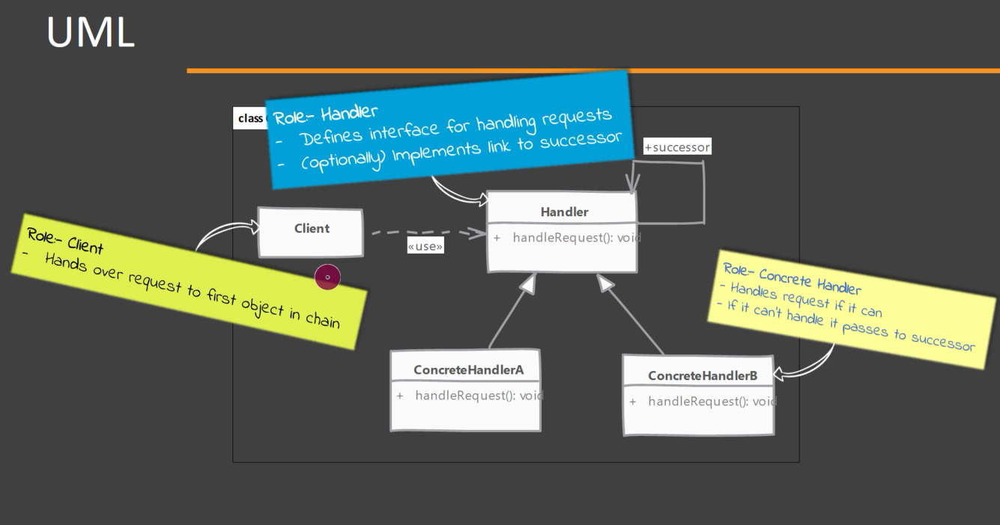
2. **Command Pattern**  
    This pattern is used when we want to represent a method call or a request as an object.  
    All information about parameters and actual operation are encapsulated within the command object.  
    The command object can also have actual reference to object on which the operation is performed.  
    Say we want to call a function `addMember` of `EWSService` object with `email` and `groupName` parameters, 
    we will pass all these to the command object say `AddMemberCommand` which will store all these references.  
    We will then pass this command object to some executor service, which will be responsible to schedule this command.  
    The invoker just needs to call command object's `execute()` method. The execute method will have all the logic defined.
    - ***Steps to implement***
        - Define a `Command` interface with `execute()` method
        - Implement Command interface and these implementations should know which function to call, 
          what parameters are needed to call the function and on which object if object needed.
        - Some command can also have undo operations for each command that it can execute.
        - Client creates command instances and sets up receiver and all required parameters
        - The command instance is shared with the invoker to execute the command when needed or feasible.
    - ***Things to consider***
        - You can support `undo` and `redo` in command which makes it very helpful
        - If any command does not require state like parameters, object etc. and only hides function calls, 
           the same Command object can be reused, saving initialization time and memory cost 
        - State of command can cause some issues if the commands are queued for a long time or when you have to maintain history
        - We can inherit other command and enhance the functionality
        - We can compose a command using multiple commands which can execute the sub commands when the macro command is executed
        - For undo feature, we can use memento pattern
    - ***Examples***
        - java.lang.Runnable: single method run, and we call operation on receiver. We can also send it for later execution
        - Action class in struts framework: URL mapped to an action class. When request is made, action is called  
    - ***UML***
      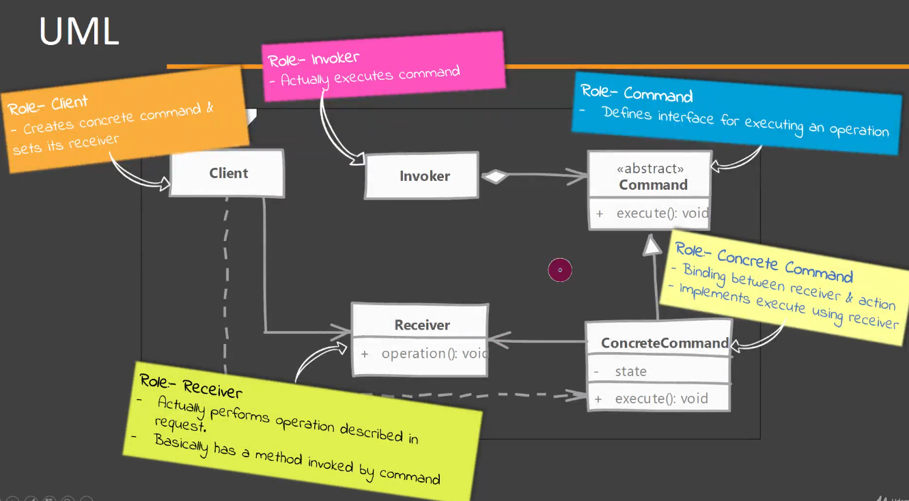
    - **Difference from Chain of Responsibility(CoR)**  
      - In CoR pattern, request is passed on if handler is unable to handle, thus it does not guarantee request being handled
         We can not reverse the action or track which handler handled the request
      - In Command pattern, request needs to be handled by the instance, thus it guarantees request to be handled
        They are trackable and storing the order of command instances also helps in reversing the same.
3. **Interpreter Pattern**  
    When we want to process a simple language with rules and grammar e.g. `boolean expression`, `mathematical expression` as String
    Interpreter is used to represent rules of the language in a Data Structure e.g. `Tree`
    We can then use say `boolean interpret(Object)` function to check if the object follows that structure or not
    e.g. A user with `admin` and `developer` permission follows the tree structure formed by `admin or owner`, `admin and developer`
    but does not follow `admin and owner`, `finance_admin or finance_manager`, `not admin`, `not developer`
    - ***Steps to implement***
        - Define or study rules of language
        - Define abstract/ interface Expression e.g. `PermissionExpression` which will represent node of expression
        - Expressions that do not require other expression, become leaf/ terminal expression e.g. `Permission`
        - Non-terminal expressions will call interpret on each of its child Expression and then merge the results as required
            e.g. `AndExpression`, `NotExpression`
        - The build of data structure like tree can be done by client itself, or a separate class e.g. `ExpressionBuilder` 
          that accepts a wrapper e.g. `Report` object or the expression e.g. `Report.permissions` directly, 
          and builds the data structure out of it.
        - The client can then use the Expression e.g. `InterpreterPatternMain.exp` returned by the builder class  
           to evaluate/ interpret if a context e.g. `InterpreterPatternMain.user1` follows the rules
    - ***Things to consider***
        - Apart from interpreting, it can also be used for pretty printing
        - Parsing is up to the developer and where to parse the expression
        - We can create context or skip it if no additional states are needed
        - We can use Visitor pattern to interpret instead of adding it to Expression class
        - We can use flyweight pattern for Terminal Expressions as these can be often reused e.g. `Permission` object for `ADMIN`
        - It causes large number of classes for simple languages also, not suitable for languages with complex grammar rules
        - It is very particular to a specific type of problem
    - ***Examples***
        - `java.util.regex.Pattern` has `compile()` to create tree. 
          ```java
            Pattern pattern = Pattern.compile("ADMIN", Pattern.CASE_INSENSITIVE);
          ```
        - `javax.el.Expression` which can be created using `javax.el.ExpressionFactory`
    - ***UML***
      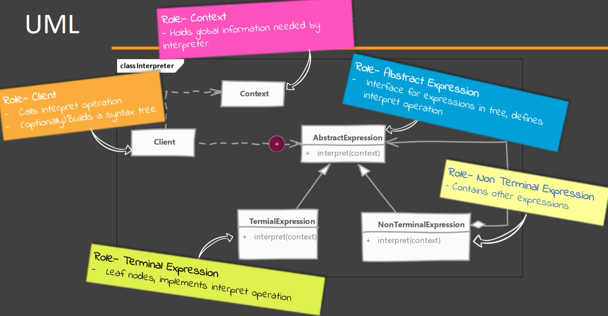
4. **Mediator Pattern**  
    Helps us remove complexity and tight coupling when objects need to interact with/ notify each other, 
     say `Slider` UI change triggers `TextBox` UI change and vice versa and also changes `Label`
    Instead of notifying each colleague, the UIControl will only inform the mediator and should only know the mediator. 
     The mediator then forwards and notifies all other UIControl about the change.
    In case we want to add or remove any UIControl from the group, we only need to update mediator class.  
    *Note: It is not necessary that all UIControl implement a common interface, 
      it might happen that all objects registered with mediator are of different type, 
      hence tight coupling may happen in Mediator class*
    - ***Steps to implement***
        - Define a Mediator which can be concrete implementation or an abstract class/ interface
        - Declare a method in Mediator that can be used to tell the Mediator that value of an object has changed and notify others.
           This method should accept the changed object so that Mediator knows which other objects to notify.
           Apart from this it may accept the changed value and pass it while notifying other objects, or skip this parameter,
           in this case, the other objects being notified are passed reference of the changed object for retrieving value
        - For the mediator to know all the participating objects, either all objects register themselves to mediator, 
           or the participating objects are created by the mediator itself
        - If value change triggers an event in participant which can cause a loop of changes and mediator calls, 
          we need to handle this e.g. change in UI value which causes change in other UI object values
    - ***Things to consider***
        - Mediator should know which object has sent the notification change so that it does not notify the caller object
        - The method call of notifying the participants should not take very long which can cause mediator to be stuck.
           Any synchronization should be handled carefully so at to avoid blocking the Mediator
        - The Mediator can get complex as it deals with different types of object, and it routes the notification to each
        - We can extend Mediators to enhance the notification based on different environments like cloud, local etc.
        - We can consider using Observer pattern to notify the Mediator of any change
        - Mediators are not usually reusable as it is tightly coupled to many objects
    - ***Examples***
        - `javax.swing.ButtonGroup` makes sure only one of the button is selected. Participating Buttons notify Mediator
        - A specialized version of Mediator pattern is `DispatcherServlet` or `FrontController` in `Spring`
            It has some characteristics of Mediator like central hub for all requests, but it also accepts external requests
            Apart from this, it also has some filtering logic based on which it selects which participant to notify
    - ***UML***
      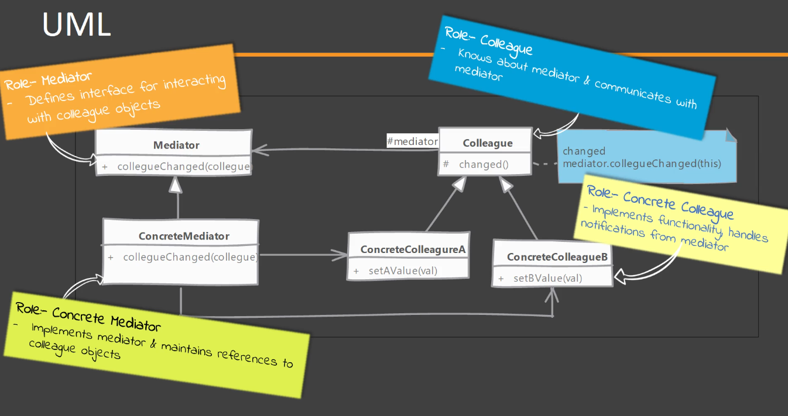
5. **Iterator Pattern**  
    When we have an aggregate object like Collection i.e. object that has instances of same class aggregated inside it,
     iterator pattern is used to give access to the instances inside the aggregator and hides the underlying data structure
    In Java, Iterators use the same design pattern to implement
    Iterators are stateful and remembers the position it is at, if the underlying values change, the iterator becomes invalid
    - ***Steps to implement***
        - Define Iterator interface with method definition used to inform if the iterator has more elements
           We use `hasNext()` for check and `next()` for retrieval of next instance
        - The iterators are defined within the class for which iterator is defined, 
           so that the underlying data structure is not exposed
        - The concrete iterator should maintain state to retain at which position it currently is at
    - ***Things to consider***
        - We need to detect change in underlying data structure if the client is using iterator and notify, 
           else the iterator it may give inconsistent results
        - Always prefer using iterators so that changing implementation can be done without affecting client code
        - Iterators are used apart from Collections in places where we want to give sequential access like lines of file
        - We do not get direct access to index when using iterator in for loop
        - Modifications to the collection while using iterator makes the iterator invalid
        - It is not mandatory to always have forward iterator, we can also have reverse or bi-directional iterators
    - ***Examples***
        - Iterator class in Collection framework. Each implementation has its own Iterator implementation
        - `java.util.Scanner` supports `InputStream` as well and allows to iterate over a stream
        - `javax.xml.stream.XMLEventReader`
    - ***UML***
      